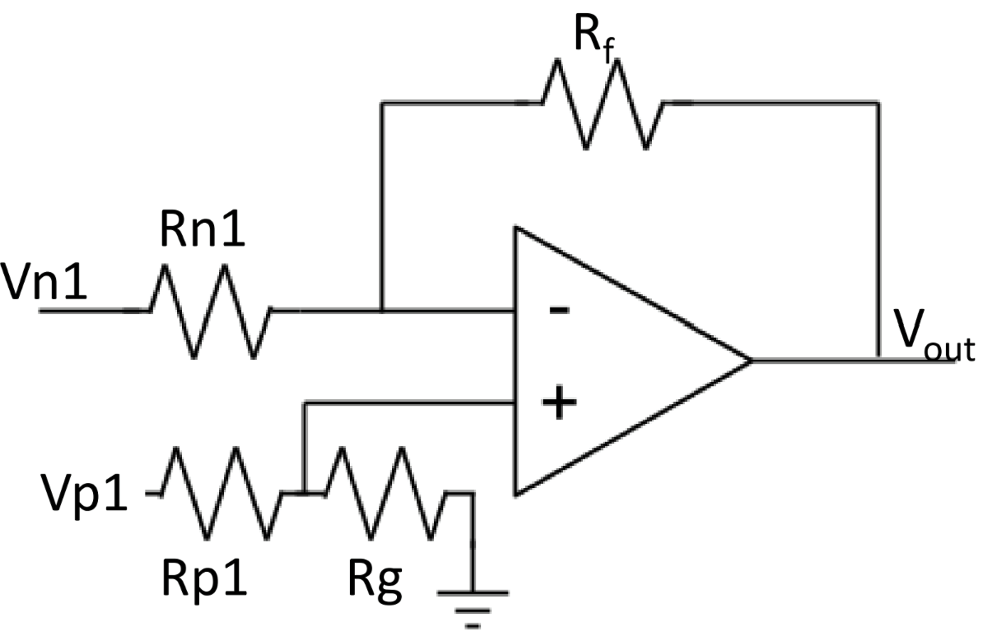

Name:

## Electrical Schematic

::: {#fig-inv-op-amp-schematic}

Placeholder schematic for inverting offset amplifier circuit. Replace with yours.
:::

Insert the schematic for your inverting offset amplifier circuit here. Don't forget your figure caption.

Text and equations to explain function and design of the circuit.
The text and equations should address, highlight, and include:

-   What circuit does
-   How the circuit works
-   Choice of components and values

::: {#fig-555-timer-schematic}

Placeholder schematic for 555 timer circuit from [LM555 Datasheet](https://www.ti.com/lit/ds/symlink/se555.pdf?). Replace with yours.
:::

Insert the schematic for your 555 timer circuit here. Don't forget your figure caption.

Text and equations to explain function and design of the circuit.
The text and equations should address, highlight, and include:

-   What circuit does
-   How the circuit works
-   Choice of components and values

::: {#fig-transimpedance-amplifier-schematic}

Placeholder schematic for transimpedance amplifier circuit. Replace with yours.
:::

Insert the schematic for your transimpedance amplifier here. Don't forget your figure caption.

Text and equations to explain function and design of the circuit.
The text and equations should address, highlight, and include:

-   What circuit does
-   How the circuit works
-   Choice of components and values