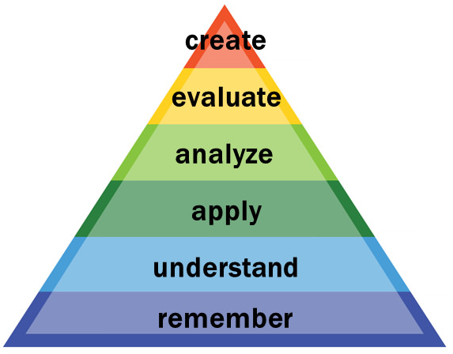
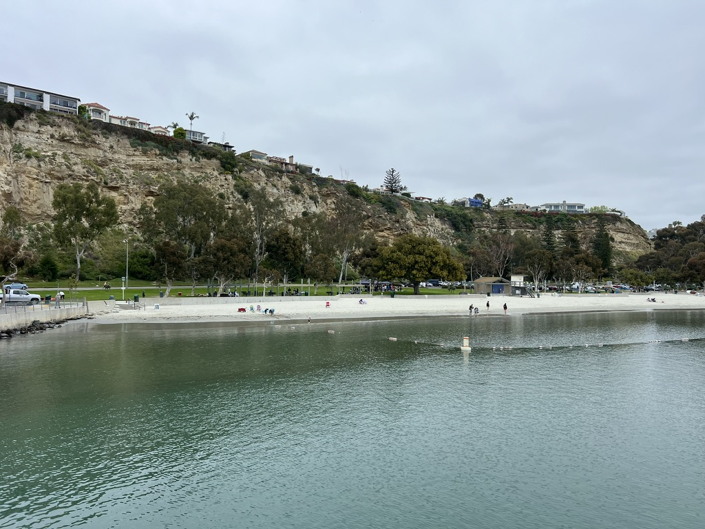
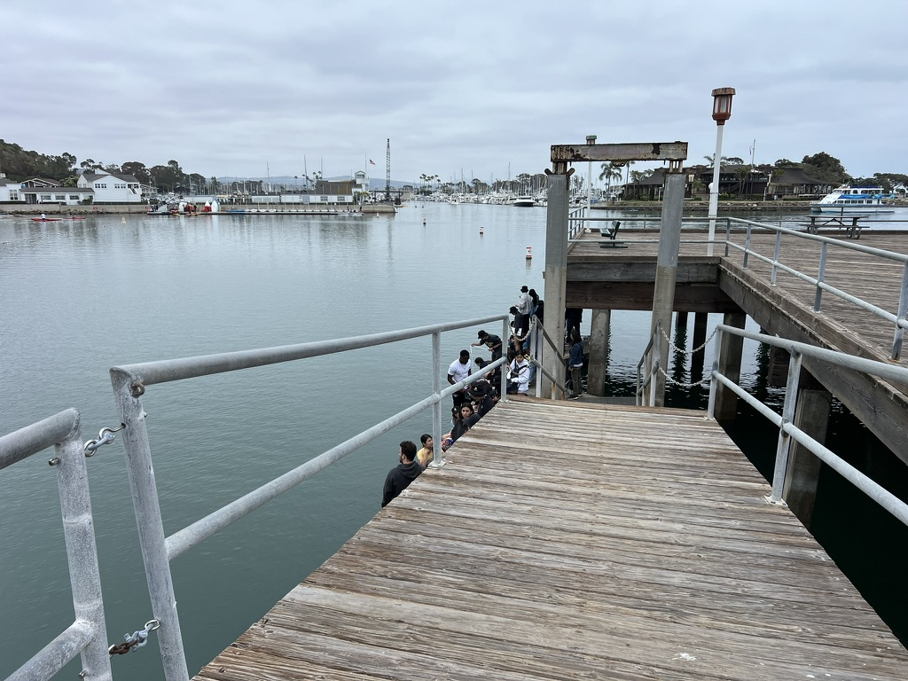
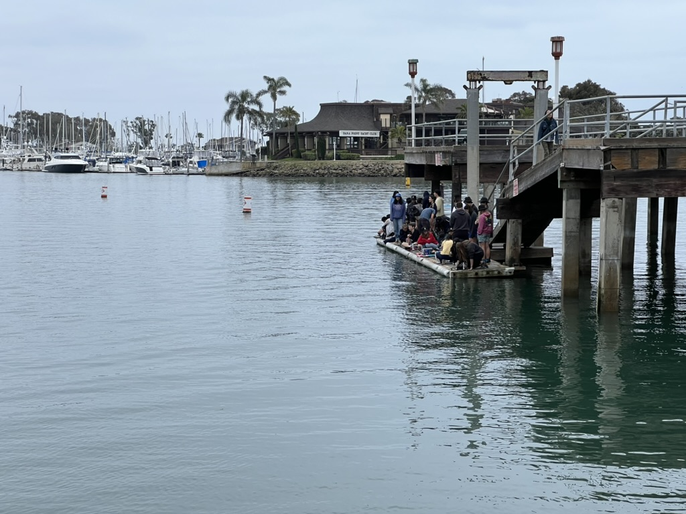
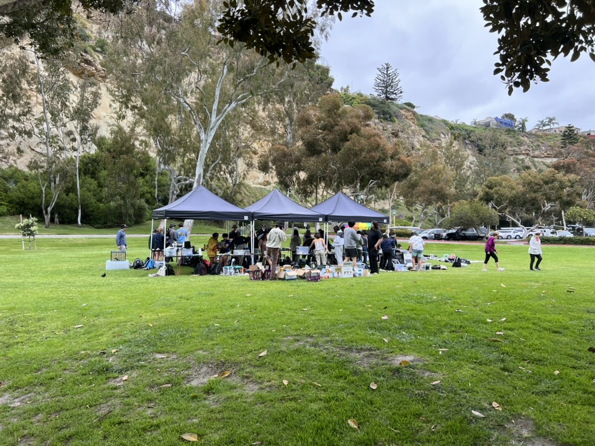
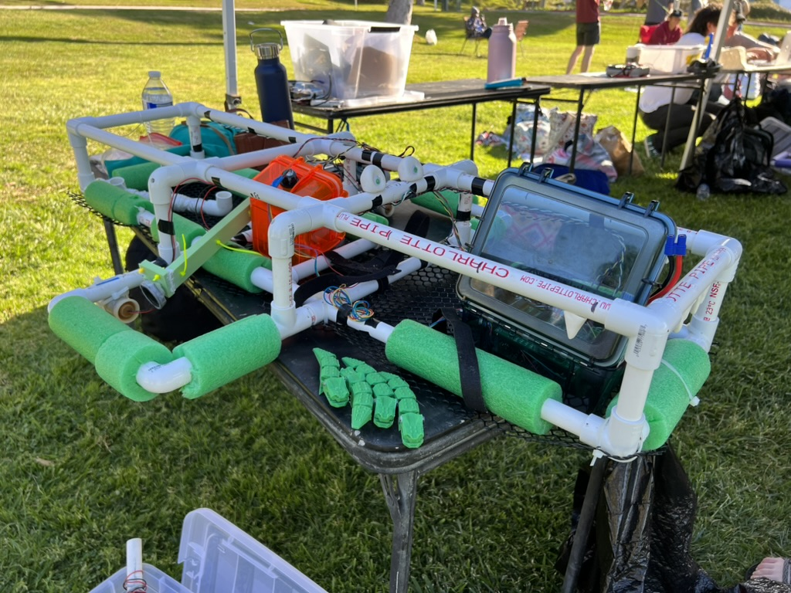
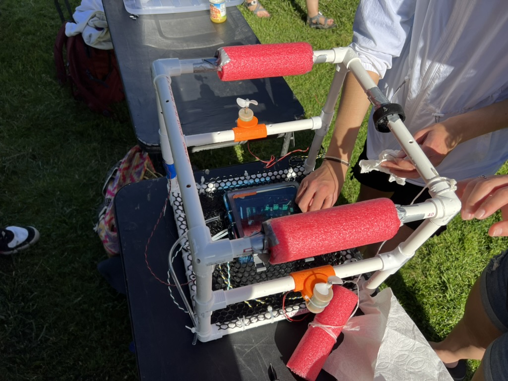

## What is experimental engineering?

- Turn to the person next to you and discuss for 60 seconds.
- Come up with a word or phrase to share out that describes an aspect of what you think engineering is.

## E80 is about forming your engineering identity and learning how to do experiments {.smaller}

In this course you will learn how to...

::: columns
::: column
**Do Experiments**

::: fragment
-   Design instrumentation
-   Gather, interpret, and present data
-   Learn domain-specific skills (e.g., using op-amps and the wind tunnel)
:::
:::

::: column
**Be an Engineer**

::: fragment
-   Deal with failure and learn from it.
-   Professionally present your experiments.
-   Know what good results look like.
-   Work effectively on technical problems as a team under pressure.
:::
:::
:::

Our goal is to take you from Students → Engineers

## Course Philosophy

Growth requires **good stress** and **progressive overload**.

::: columns
::: {.column width="50%"}
::: fragment
{fig-align="center" width="33%"}
:::
:::

::: {.column width="50%"}
::: fragment
{fig-align="center" width="100%"}
:::
:::
:::

## Teaching Team

::: {layout="[[1,1,1], [1,1,1]]"}

{text-align=" width="150px"}

{width="150px"}

{width="150px"}

{width="150px"}

{width="150px"}

{width="150px"}
:::

## Course Overview

Key places for course information:

::: {.incremental}
-   **Course website:** Source of truth for all course-related information. Contains all assignment instructions, templates, submission sheets, etc.
-   **Discord:** Platform for getting help from the teaching team.
-   **Canvas:** The place to submit everything.
:::

## Course Overview: Labs & Project Phases {.smaller}

#### Labs

::: fragment
Each lab has an experiment and a writing component.

-   Experiments are done during your 4-hour lab section.
-   Writing is done in the Friday Writing & Reflection period.
:::

#### Project

::: fragment
The project is the chance for you to design and perform your own experiment using the skills you've developed in the labs.

You propose an experiment and design a robot with the appropriate sensors to make measurements.
:::

## Bloom's Taxonomy

::: {#fig-blooms-taxonomy}

[Bloom's Taxonomy, Vanderbilt University Center for Teaching](https://cft.vanderbilt.edu/guides-sub-pages/blooms-taxonomy/).
:::

## Learning Outcome Categorization

::::: {.columns}
::: {.column}
::: {.r-fit-text}

- Modify an E79 robot to build an E80 robot.
- Program your robot to traverse basic trajectories.
- Extract data from your robot, import it into MATLAB, and plot it.
- Use statistical measures to analyze data gathered from your robot.
- Explain the limitations and challenges of open loop control.
- Relate your robot's behavior to governing equations from E79.

:::
:::
::: {.column}

:::
:::::

::: {.fragment .callout-tip title="Learning Outcome Categorization"}
Categorize the learning outcomes above using Bloom's Taxonomy.
Do it individually, then discuss with your neighbor.
:::

# Schedule

## Scheduling & Details {.smaller}

E80 moves quickly and you've got multiple things to turn in each week.

[Canvas is the place to turn everything in!]{style="color:red"}

#### 1. Lecture Quiz

::: fragment
Watch lecture videos and take quiz each week. [Due each Monday at 12 pm (noon).]{style="color:red"}
:::

#### 2. Lab Submission Sheet

::: fragment
Submit key deliverables collected in lab. [Due at the end of your lab section each week (5:15 pm).]{style="color:red"}
:::

#### 3. Writing & Reflection Section

::: fragment
Bring deliverables from lab each week. Write a small section of a technical memo each week, review it to meet spec, and check it off with an instructor. [Due at Friday at 3:15 pm.]{style="color:red"}
:::

#### 4. Weekly Team Check In

::: fragment
Fill out a survey to help you assess how your team is doing and if there are any issues developing. [We will give you time to complete this at the beginning of the Writing & Reflection Section on Friday. Due Friday at 3:30 pm.]{style="color:red"}
:::

## Weekly Schedule {.smaller font-size="12"}

| Day       | Lecture Quiz              | Submission Sheet     | Write Up     | Weekly Check In |
|---------------|---------------|---------------|---------------|---------------|
| Monday    | Noon (Canvas) |                      |              |                                 |
| Tuesday   |                           | 5:15p (E80-01) |              |                                 |
| Wednesday |                           | 12:15p (E80-02) |              |                                 |
|  |                           | 5:15p (E80-03) |              |                                 |
| Thursday  |                           | 5:15p (E80-04) |              |                                 |
| Friday    |                           |                      | 3:15p | 3:30p                    |

## Scheduling Activity

Every week you need to have the following time carved out.

| Item                         | Time Required \[hours\] |
|------------------------------|-------------------------|
| Lab                          | 4 hours                 |
| Writing & Reflection         | 2 hours                 |
| Watch Lecture Videos         | 1 hour                  |
| Take Lecture Quiz            | 30 minutes              |
| Pre-lab Work & Team Meetings | 4.5 hours               |

## Team Startup

::::: {.columns}
::: {.column width=70%}
1. Schedule a time for you to meet as a team of 4 (or 5) each week.
2.  Create a shared file storage location (e.g., a shared Google Drive folder or Shared Drive).
3.  Decide how you want to communicate this semester (e.g., email, text thread, Discord, Slack, etc.).
4.  Block out time for all the activities on the previous slide on your calendar!
:::
::: {.column width=30%}

:::
:::::

# Important Policies

## Pre-lab vs. Post-lab

E80 has strict limits on what you can and cannot do during pre-lab.
**Learning how to prepare well in pre-lab is one of the most important aspects for maximizing your learning in E80.**

During the pre-lab period you...

::: {.incremental}
- [**can**]{style="color:green"}: perform calculations, read datasheets, ask how equipment works, write software, calculate expected results, talk to professors.
- [**may not**]{style="color:red"}: collect data, test hardware, populate breadboards, use laboratory equipment.
- When in doubt, ask a professor.
:::

## Specifications: Effort and Completion

The grading in E80 this semester for submission sheets and writing assignments is based on whether or not your deliverables meet two different levels of specifications: **effort** and **complete**.

::: fragment
-   Effort specs describe **good-faith effort**.
:::

::: fragment
-   Completion specs describe **correctness**.
:::

::: fragment
In most situations, completing effort specs is equivalent to a passing grade on the assignment and the remaining sections of completion specs are worth a grade level each.
:::

## Effort and Completion Specifications Example: Lab 1

## Resubmission Policy {.smaller}

Learning is about iterative feedback.

We allow you a limited number of opportunities to revise your work if you don't meet all the specifications for an assignment on the first try.

::: incremental
- You must submit **something** by the deadline.
- You can revise and resubmit up to two submission sheets during the week before spring break.
- Resubmissions are checked off in an in-person meeting with an instructor.
- For all submissions, you will need to self-assess **before** you submit. Every assignment you submit should be accompanied along with a checklist of specs that you believe the assignment meets or does not meet.
- All resubmissions must be completed by spring break.
:::

## Resubmission Policy Continued {.smaller}

The resubmission policy limitations are described in detail on the syllabus.
**Please read it carefully!**

::: {.incremental}

- Resubmitted assignments are worth full credit (i.e., no penalty for resubmitted work).
- All writing assignments may be revised and resubmitted during resubmit week.
- Up to **two** lab submission sheets may be resubmitted:
  - One from a full-team lab (Labs 1, 5, or 6). It must be resubmitted by the **entire team**. The updated grade for this lab will be applied to all the team members.
  - One from a sub-team lab (Labs 2, 3, or 4) that will be completed **as an individual**. The updated grade will be applied only to the individual who resubmitted it (i.e., not to the other team member).
:::

# Team Formation

## Google Project Aristotle describes the attributes of a high-functioning team

::: incremental
1.  **_Psychological Safety_**
2.  Dependability
3.  Structure and Clarity
4.  Meaning
5.  Impact
:::

::: fragment

[Google Blog Post on Project Aristotle (Web Archive)](https://web.archive.org/web/20230926081613/https://rework.withgoogle.com/blog/five-keys-to-a-successful-google-team/)

:::

## Team Formation Refresh

-   Psychological Safety: creating an environment where team members are comfortable taking risks and speaking up.
-   Team Norms: A set of agreements about how the team will operate.

"I’m giving you these comments because I have very high expectations and I’m confident you can reach them." - advice on feedback from Adam Grant

## Team Contract Activity {.smaller}

::::: {.columns}
::: {.column width=70%}
1.  Go to the course website and download the team contract form (found on the lectures page).
2.  Discuss with your team and fill out the missing sections.
3.  When you think you are finished, fill out the checklist of effort and completion specs and change your status on the tracker spreadsheet.
4.  After you get feedback, make the suggested revisions and submit a PDF of your the team contract and PDF of the completed checklist with any notes to Canvas.
:::

::: {.column width=30%}

:::
:::::

## You are going to build cool stuff!

::: columns
::: column

:::

::: column

:::
:::

Your E80 board has a GPS, IMU, Tiny Computer, 5 amp Motor Driver, and you'll use the full robot in Lab 1.

# A Launch Day Preview

##
::: {.center-x}
{width=800px}
:::

##

::: {.center-x}
{width=800px}
:::

##

::: {.center-x}
{width=800px}
:::

##

::: {.center-x}
{width=800px}
:::

##

::: {.center-x}
{width=800px}
:::

##

::: {.center-x}
{width=800px}
:::
## Engineering Department Climate Survey

Open your email and search for an email you received from Prof. Harris on Wednesday 1/21 with the subject line "Engineering Department Climate Survey".

::: {.timer #Timer3 seconds=600 starton=interaction}
:::

## Snacks

Join us for a social in the Shakespeare Theatre (outside Shan) with snacks and mingle with your peers, E72 and E80 proctors, sophomore mentors, and the E72 and E80 teaching teams.