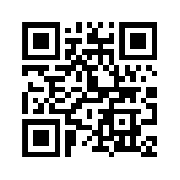
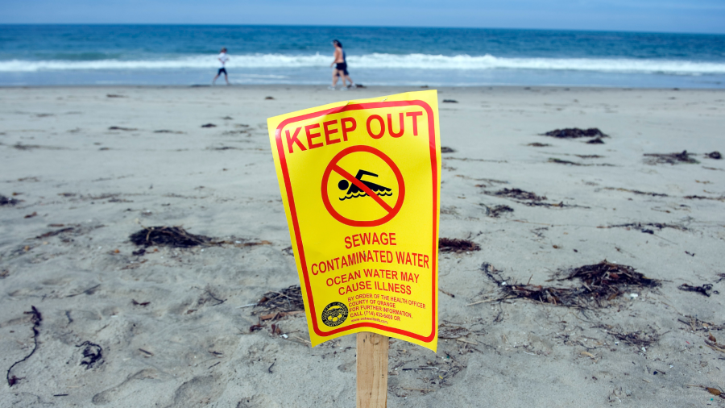

## Agenda for Today

-   Logistics & Schedule
-   Project Resources
-   Project Requirements
-   Design Activity
-   Project Deliverables

## Soon this will be you!

{fig-align="center"}

## E80 is about forming your engineering identity and learning how to do experiments

In this course you will learn how to...

::::::: columns
:::: column
**Do Experiments**

::: fragment
-   Design instrumentation
-   Gather, interpret, and present data
-   Learn domain-specific skills (e.g., using op-amps and the wind tunnel)
:::
::::

:::: column
**Be an Engineer**

::: fragment
-   Deal with failure and learn from it.
-   Professionally present your experiments.
-   Know what good results look like.
-   Work effectively on technical problems as a team under pressure.
:::
::::
:::::::

## Remaining Course Schedule Before Spring Break

+---------------+---------------------------------------------------------+
| Week          | Activity                                                |
+===============+=========================================================+
| Monday 2/23   | -   Week 1 of Lab 5/6 Rotation                          |
|               | -   Project kickoff presentation today!                 |
+---------------+---------------------------------------------------------+
| Monday 3/2    | -   Week 2 of Lab 5/6 Rotation                          |
|               | -   Writing section focused on rough draft of tech memo |
+---------------+---------------------------------------------------------+
| Monday 3/9    | -   Project proposal                                    |
|               | -   Tech memo due                                       |
|               | -   Resubmits                                           |
+---------------+---------------------------------------------------------+
| Monday 3/16   | Spring Break                                            |
+---------------+---------------------------------------------------------+

## Deliverables for the Next Few Weeks

+----------------------------------+------------------------------------+-----------------------+
| Deliverable                      | Due Date                           | Notes                 |
+==================================+====================================+=======================+
| Lab Writing Assignment Resubmits | 3/6                                | Individual            |
+----------------------------------+------------------------------------+-----------------------+
| Lab 6 Technical Memorandum       | 3/13                               | Individual            |
+----------------------------------+------------------------------------+-----------------------+
| Project Proposal                 | 3/13                               | Team                  |
+----------------------------------+------------------------------------+-----------------------+
| Lab Resubmits                    | End of lab section in week of 3/9 | Individual/Team       |
+----------------------------------+------------------------------------+-----------------------+

## Activity: Think, Pair, Share Reflection

::::: columns
::: {.column width="50%"}
-   What is the most important thing you've learned in E80 **labs**?
-   What is the most important thing you've learned in E80 **writing assignments**?
-   What **technical** skill do you most want to further explore in the project phase?
-   What **non-technical** skill do you most want to further explore in the project phase?
:::

::: {.column width="50%"}

<https://tally.so/r/dWYY0N>
:::
:::::

## Project Jump Start

Projects give you the space and freedom to design a robot of your own choosing, but there are a few elements that are common across almost all E80 robots:

1.  Autonomous operation and navigation
2.  Running and modifying the provided base software for the robot

To get you up to speed up on these common elements, we'll have a more structured week of lab in the first week after Spring Break.

## Project Timeline and Deliverables

::: r-fit-text
+-----------+-----------------------------------------+-----------------------------------------------------------------------------------------------------------------------+
| Week      | Activity                                | Deliverable                                                                                                           |
+===========+=========================================+=======================================================================================================================+
| 1         | Project Jump Start                      | - A graded Submission Sheet due at the end of your section.                                                             |
+-----------+-----------------------------------------+-----------------------------------------------------------------------------------------------------------------------+
| 2         | Breadboard Demo                         | - Demo of breadboarded circuits to a professor. (Highly recommended, but not required).                                 |
+-----------+-----------------------------------------+-----------------------------------------------------------------------------------------------------------------------+
| 3         | Soldered Protoboard Demo                | - Demo of soldered circuits to a professor. (Highly recommended, but not required).                                     |
+-----------+-----------------------------------------+-----------------------------------------------------------------------------------------------------------------------+
| 4         | Integrated Robot Deployment             | - None, though deployment during your section at Phake Lake is the first chance to get data for your report.            |
+-----------+-----------------------------------------+-----------------------------------------------------------------------------------------------------------------------+
| 5         | Rebuild and Final Deployment            | - None, though deployment *on Saturday* at Dana Point is the second and last chance to get data for your report.        |
+-----------+-----------------------------------------+-----------------------------------------------------------------------------------------------------------------------+
| 6         | Analyze Data & Final Report Conferences | - Rough draft of report due on Tuesday at noon. Individual conferences with professors.                                 |
+-----------+-----------------------------------------+-----------------------------------------------------------------------------------------------------------------------+
| 7         | Individual Final Report & Team Poster   | -   Poster due by 3:30 pm on Friday, May 1. Poster session on Wednesday, May 6 during Presentation Days at 4 pm. |
|           |                                         | -   Final report due Friday May 8 at 11:59 pm                                                                        |
+-----------+-----------------------------------------+-----------------------------------------------------------------------------------------------------------------------+
:::

## Final Report and Poster

::: fragment
**Poster:**

- Team deliverable.
-   Given during presentation days.
-   Aimed at a technically-knowledgeable audience to communicate the main results of your project.
-   Will be presented during poster session. Your whole team is required to be there.
-   You will answer questions about your poster and also interact with your peers.
:::

::: fragment
**Report:**

- Individual deliverable.
- Individual conference with professor during analysis week.
-   Presents the results of your team's experiments, instrumentation, and results.
:::

## Deployments

You must collect data from your deployments for your final report.

::: fragment
**Week 4: Bernard Field Station (BFS)**

-   First chance to get field data which is required in the final report.
-   Need a deployment plan and launch checklist.
:::

::: fragment
**Week 5: Dana Point**

-   Bus leaves from Mudd at 6:30 am on 4/25/26 and returns \~4:00 pm. Be there!
:::

# Project Launch

## Project Requirements

-   Autonomous deployment for at least one minute with active position control.
-   The deployment must end at a place where the robot can be recovered.
-   Sensor package
    -   Deployed on or from your AUV
    -   Must use at least three sensors with at least two unique electrical interfaces.
    -   The IMU, GPS, and motor current sensors don't count toward your three sensors.

## What we give you to start from

Default Robot code base (under `/Default_Robot/` directory in the Git repository)

Some key pieces:

-   GPS surface navigation
-   Diving
-   Template code for integrating your own custom libraries (`ButtonSampler` library)

## You have a few options for launching at Dana Point

Kayaks are also available to accompany your robot out into the center of the harbor.

## Resources: Support

-   Full teaching team in lab hours
-   Profs and proctors in office hours

## Resources: Stuff

-   Anything in lab – sign out expensive stuff & submit error reports for anything that breaks.
    -   The E80 main PCBs and protoboards
    -   E80 frames, boxes and penetrator bolts
-   Stuff outside lab: \$50 budget per team as long as you follow purchasing instructions

## Resources: Strict Purchasing Protocol

-   Must be checked off by two instructors before buying
-   Each team has only one designated buyer, all purchases from that one person
-   Submit engineering purchase request form
    -   Include team number
    -   Specify Prof. Helmns as approver
    -   Specify purchase is for E80
-   We almost never agree to rush shipping … plan around 5-7 days lead time.

## Resources: Where can I buy Stuff?

-   Electronics – Digikey, Mouser, JameCo, SparkFun, Adafruit
-   Mechanical – McMaster-Carr

### Tips

-   Make sure you consider package type! Buy adapter boards for surface mounted (SMT) parts.
-   Make sure that you only buy parts that are in stock.

## Resources: Our Waterproof Boxes

-   Can fit about 6 wires in a penetrator bolt.
-   Drill on flat faces of box: need flat rubber washers on box surface.

+:----------------------------:+:---------------------------:+:----------------------------:+
|  |  |  |
+------------------------------+-----------------------------+------------------------------+

## Resources: Our Main PCB

::::: columns
::: {.column width="50%"}
-   GPS / Teensy / IMU
-   H-Bridges + resettable fuses
-   Battery LED & switch
-   Input protection
-   User button
-   Programmable LED
-   Current Monitor / Flag
-   2x Check Solder Joints
-   Connector
:::

::: {.column width="50%"}

:::
:::::

## Resources: Our Protoboard

Protoboard connects to the motherboard with a right angle header and mounts above the main PCB.

::::: columns
::: {.column width="50%"}

:::

::: {.column width="50%"}
{width="120"}
:::
:::::

## Considerations when Picking Sensors

**Package type** – thru hole vs. surface mount w/ adapter board

**Interface**

+------------+------------+---------------------------------------------------+
| Interface  | Difficulty | Details                                           |
+============+============+===================================================+
| GPIO       | Easy       | Using D3 and D4, can make sampler                 |
+------------+------------+---------------------------------------------------+
| I2C        | Medium     | Using SCL and SDA pins, some configuration        |
+------------+------------+---------------------------------------------------+
| UART       | Medium     | Using RX and TX pins, some configuration          |
+------------+------------+---------------------------------------------------+
| SPI        | Hard       | Needs to be implemented in software (bit banging) |
+------------+------------+---------------------------------------------------+

[MUST BE IN STOCK!]{style="color:red"}

## Experimental Design Considerations

+-----------------------------+
|  |
+-----------------------------+

-   **Purpose:** What are the scientific and/or engineering goals of your E80 project? What are the social and/or environmental impacts of this choice?
-   **Electronics Elements:** Audio, Digital interfaces, Communication, Telemetry
-   **Software Elements:** Time of flight, Advanced navigation, Diving
-   **Mechanical Elements:** Shape, Sensor placement, Winch, Diving, Tethers

+----------------------+--------------------------------------+
|  | {width="162"}    |
+----------------------+--------------------------------------+

# Final Project Design Exercise

## Project Ideation Activity

Recall the steps of the Engineering Design Process.

## Two dispositions for thought processes

## Round 1: What do you care about?

“We don’t know how to measure what we care about, so we care about what we measure” - Richard A. Tapia

-   Review the Project Impact pre-reading
-   Reflect individually on your project’s purpose - what do you want to study and why?
-   Come together as a team and share your reflections

## Round 2: What do you want to measure?

-   What do you want your robot to measure?
-   Broadly in two categories: scientific and engineering relationships
    -   Scientific examples: water quality, distribution of temperature, salinity, turbidity
    -   Engineering examples: sensor accuracy, battery life, sensor or craft mechanical durability, velocity vs. power

## Instructions

-   Split into groups and find a big Post-It for your team
    -   Write your team number on the top
-   Write down any quantities that you think would be interesting to measure with/on your robot.
-   Focus on quantity over quality—we’re going for as many ideas here as possible.
-   Feasibility doesn’t matter (yet)!

## “Yes, and” wild stories

## Round 3: Give feedback on delightful ideas

-   Split your team in half. Half move to the big sticky on the right, half move to the big sticky to the left.
-   Use the dots to vote for the idea(s) you find most delightful or fascinating (do NOT consider feasibility at this point).
    -   You get 3 votes each
    -   You may vote for the same idea more than once.

## Round 4: How do you want to measure it?

-   Review the feedback you got from your classmates’ dot votes.
-   Select 3 ideas that you wish to explore further.
-   For each idea, sketch a plot of the key figure that you hope to generate as the result of your project.

## Think about the axes of your measurements

-   What is the **independent** variable?
-   What is the **dependent** variable?

+------------------------------+----------------------------------------+
|     | {width="540"} |
+------------------------------+----------------------------------------+

## Round 4: How do you want to measure it?

-   What are your...
    -   Independent variable(s): e.g., $t$, $x$, $y$
    -   Dependent variable(s): e.g., $y(t)$, $z(x,y)$
-   Specify for each variable
    -   Units
    -   Expected ranges
    -   Resolution required (e.g., sampling frequency in time/space, sensitivity)

## Round 5: What instrumentation will you use?

For each desired quantity, list out any ways that you can think of to measure that quantity.

-   What is the transduction method (e.g., electrical, mechanical, chemical, combination, etc.)
-   What types of sensors might you use? Think about what you’ve used or seen in E80 so far for inspiration.

## Wrap Up

+----------------------------------+------------------------------------+-----------------------+
| Deliverable                      | Due Date                           | Notes                 |
+==================================+====================================+=======================+
| Lab Writing Assignment Resubmits | 3/6                                | Individual            |
+----------------------------------+------------------------------------+-----------------------+
| Lab 6 Technical Memorandum       | 3/13                               | Individual            |
+----------------------------------+------------------------------------+-----------------------+
| Project Proposal                 | 3/13                               | Team                  |
+----------------------------------+------------------------------------+-----------------------+
| Lab Resubmits                    | End of lab section in week of 3/9 | Individual/Team       |
+----------------------------------+------------------------------------+-----------------------+
