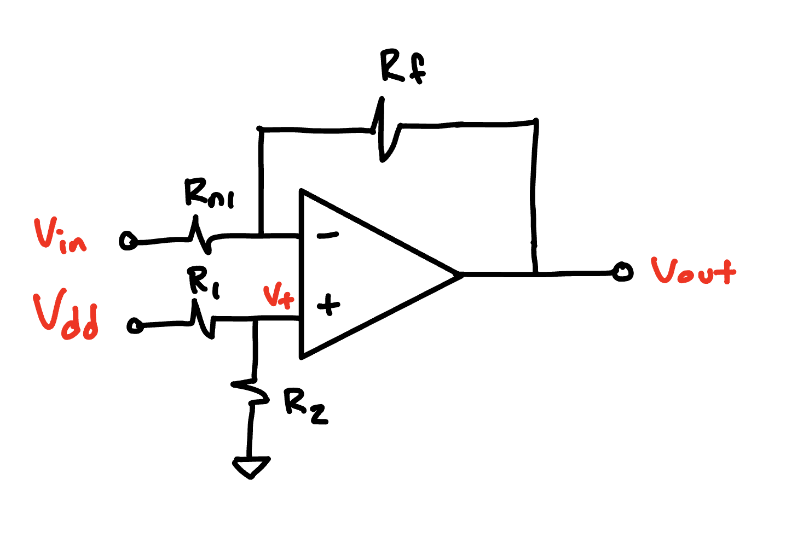
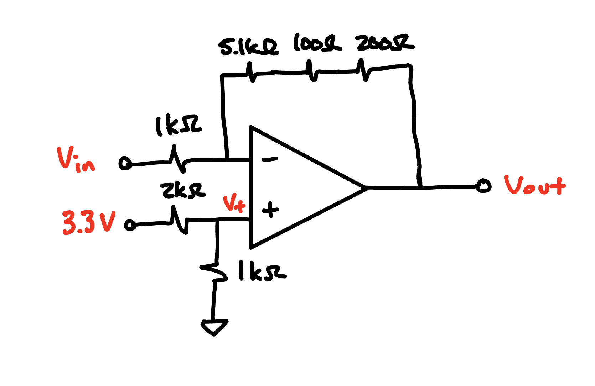
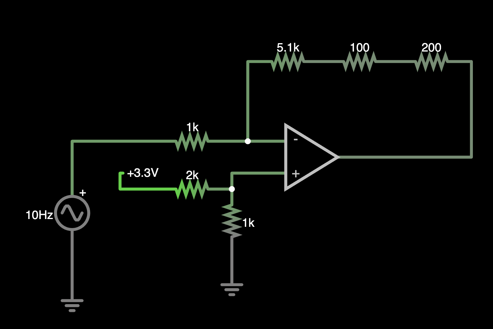

This tutorial will describe how to build an offset amplifier.
There are many different amplifier topologies that can be built, but for the sake of simplicity in E80 we will only build a specific implementation that will be described here.

## Introduction to Offset Amplifiers in E80

An offset amplifier is a linear mapping.

It takes an input signal and manipulates it with two parameters:

1. A gain which **scales** (multiplies) the input
2. An offset which **shifts** the input.

The amplifier we will describe below and that we recommend you use in E80 is described by the following equation:

$$
V_\text{out} = -G\cdot V_\text{in} + V_\text{offset}
$$ {#eq-linear-mapping}

Where $G$ is the gain and is strictly greater than 0 and $V_\text{offset}$ is the offset voltage and must lie between the supply rails of the op amp.

## The offset amplifier topology

The circuit used to implement this equation is shown in @fig-offset-amplifier-circuit-diagram.

::: {#fig-offset-amplifier-circuit-diagram}

A circuit diagram of the offset amplifier topology we use in E80.
:::

In this circuit, $V_\text{in}$ is the input voltage that you want to scale and shift, $V_{+}$ is the input voltage to the non-inverting input (which can be set using a voltage divider consisting of $V_\text{dd}$, $R_1$ and $R_2$).
$V_{dd}$ is the supply voltage which is commonly 3.3 V or 5 V.
Resistors $R_{f}$ and $R_{n1}$ are used to configure the gain.

The output voltage for this amplifier can be written as follows:

$$ 
V_\text{out} = - \frac{R_f}{R_{n1}}\cdot V_\text{in} + \left(1+G\right)\cdot V_+
$$ {#eq-offset-amplifier}

The offset voltage $V_+$ can in turn be configured using a voltage divider according to the equation below.

$$
V_+ = V_\text{dd} \cdot \frac{R_2}{R_1 + R_2}
$$ {#eq-voltage-divider}

## Analyzing the circuit

Comparing @eq-linear-mapping and @eq-offset-amplifier we can see that the following relationships hold.

$$
\begin{align}
G &= \frac{R_f}{R_{n1}} \\
V_\text{offset} &= (1+G)\cdot V_+
\end{align}
$$

## How to build an offset amplifier

This section will describe how to implement the offset amplifier.
The steps are as follows:

1. Define input and output voltage ranges
2. Created ordered pairs of input and output voltages
3. Calculate gain and offset voltage
4. Choose resistor values to implement desired gain and offset

Let's show this as an example.

### Offset amplifier example

Say that you are given a sensor which outputs voltages within a range of 0.8 to 1.3 V.
Given that the input voltage range of the analog to digital converter on our Teensy is 0 V to 3.3 V, we want to scale and shift the input voltage so that the transformed output voltage lies within this range.
We also want to leave a bit of margin at the top and bottom of the range, so we'll map the input voltage to the output voltage range 0.3 V to 3 V.

First, lets start by creating a table to collect the desired input/output voltage pairs.

| $V_\text{in}$ [V] | $V_\text{out}$ [V] |
|----|----|
| 0.8 | 3 |
| 1.3 | 0.3 |

::: {.callout-warning}
Because our amplifier can only have a negative gain, we need to make sure that the minimum input voltage is paired with the maximum output voltage and the maximum input voltage is paired with the minimum output voltage.
:::

Next, we need to set our system of equations to solve for the gain and offset needed.
That system of equations is given as:

$$
\begin{align}
3 &= -G\cdot 0.8 + \left(1+G\right) V_{+} \\
0.3 &= -G\cdot 1.3 + \left(1+G\right) V_{+}
\end{align}
$$

There are a variety of ways we can solve this system of equations.
The simplest way is to subtract the bottom equation from the top equation.
This eliminates the offset terms $\left(1+G\right) V_+$ and gives us:

$$
\begin{align}
2.7 = - G\cdot(0.8 - 1.3) \\
2.7 = - G\cdot (-0.5) \\
G = \frac{2.7}{0.5} = 5.4.
\end{align}
$$

Once we have this gain value, we can return to either of the earlier equations and solve for $V_+$.

$$
\begin{align}
3 = - (5.4)(0.8) + \left(1+5.4\right) V_+ \rightarrow
V_+ = 1.14 \text{ V}
\end{align}
$$

### Selecting components

Next we need to implement these values using actual components and voltages in our circuit.

#### Implementing Gain

First, to implement the gain we need to choose the appropriate ratio of resistors.
Since $G=\frac{R_f}{R_{n1}}$ we need to choose $R_f$ and $R_\text{n1}$ together to implement them.
Referring to the [lab inventory page](reference/inventory/), we can see that we can achieve the desired gain by choosing a  $1k\Omega$ resistor for $R_\text{n1}$ and using a 5.1 $k\Omega$ resistor in series with a 200 and 100 $\Omega$ resistor to reach $5.4k\Omega$ for $R_f$.

#### Implementing Offset Voltage

Next we need to confirm the offset voltage.
The offset voltage of 1.14 V can be achieved using a voltage divider to divide the 3.3 V source.
We know the desired division ratio is $1.14/3.3=0.345$.
Reviewing the resistor table we can see that a divider given by $R_2=1k\Omega$ and $R_1=2k\Omega$ will give us a ratio of 0.333.
This is not exactly the desired value of 0.345, but is within 10%.

::: {.callout-note}
If we wanted to get closer, we could increase the ratio by adding an additional resistor in series with $R_2$.
In general, we will need to always confirm the measured resistance value in lab with a mulitmeter before we try to dial the division ratio in given that the 5% tolerance given by the resistors will already create a level of inaccuracy compared to our design values.
:::

Now that we have all the values, we can draw the final circuit diagram which is shown below in @fig-completed-example-offset-amplifier.

::: {#fig-completed-example-offset-amplifier}

A schematic of the completed offset amplifier.
:::

## Video Examples

### Confirming operation with Falstad

::: {#fig-circuit-simulation}

:::

@fig-circuit-simulation shows the circuit used to simulate our design.

The video below shows you how to build, debug, and simulate the circuit in online circuit simulator [Falstad](https://www.falstad.com/circuit/).

<iframe src="https://www.loom.com/embed/1e822a4ebbb44002b5233d876d227198?sid=edf51c85-3763-49e6-9300-3b7cc34fb673" frameborder="0" webkitallowfullscreen mozallowfullscreen allowfullscreen style="position: absolute; top: 0; left: 0; width: 100%; height: 100%;"></iframe>

### A Graphical Illustration of the Linear Mapping of an Offset Amplifier

The video below shows you a graphical illustration of what an offset amplifier is doing: creating a linear mapping between a range of input and output voltages.

<iframe src="https://www.loom.com/embed/562fda7364c7401e935c0435bc8e8ae9?sid=3e397e8e-6e28-4a5d-80d9-7af8775208af" frameborder="0" webkitallowfullscreen mozallowfullscreen allowfullscreen style="position: absolute; top: 0; left: 0; width: 100%; height: 100%;"></iframe>

<!-- Link to solution circuit: https://www.falstad.com/circuit/circuitjs.html?ctz=CQAgjCAMB0l3BWcMBMcUHYMGZIA4UA2ATmIxAUgpABZsKBTAWjDACgBDEFBQ7lGiGx5BKASDzUqYePHDQwdMAgTYMNPGGKReksAqVqeNbVsKRyM2WwBO3GtLAohkQa2dUEV20LTgnQiL+HsiQPg6OzjSEbgFUaGF2iqL43KloktLwPsn28eICVPHZdoXcvHlC2HxZ5mwA5pXVkmXCgkUNIMR82H7dVTVQbABuXT2uY2mZ4LRF0DzyOlBQ0AhsAErgKC0OWy0YIVS72ND0RStrAO6TuIL9vR3X-RngNCmZbNcv3xUvYV+-dIVMDmIYAvgg+K7SFgyowsruWG3YK+SJIoKIiIo-60GIojRonEE-F4fLtT6BUTiYliclfAq7MplHFMxm-XYsxlc+IVTlUbDVJqED7XJw7aRvSphAD2XRAeKOkGIkhOrisWDQGAI6jOsDgECOcvoKAN3Ag2DYQA -->